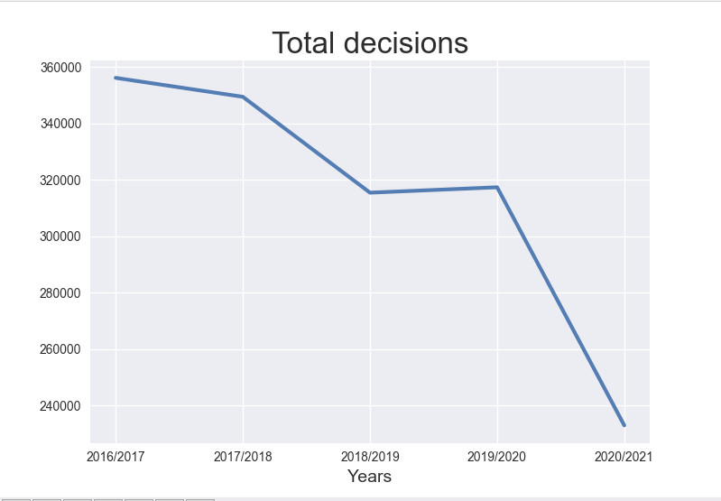
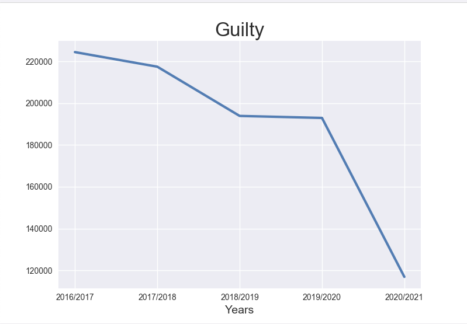
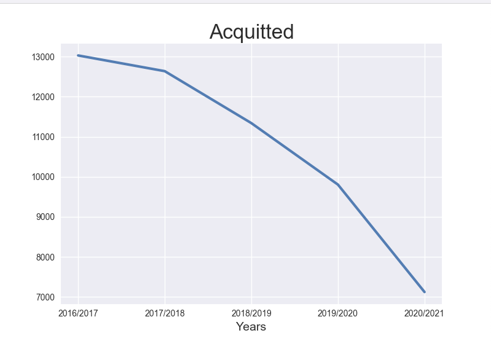
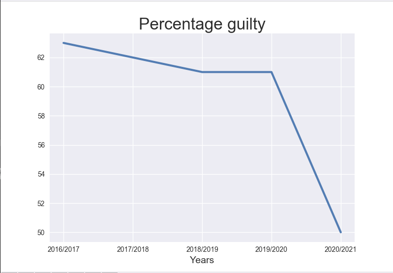

# DataVisualizationPersonalProject

## Description
This project is data visualization of the adult cases within the 4 years (2016/2017 ~ 2020/2021). The data was downloaded from the Statistics Canada as a CSV format. I was able to use libraries such as pandas and matplotlib for cleaning/parsing data and plotting the graph. The project is divided into two python files, one being the model (class) of the data with methods of cleaning the data and the other being the visualizing the data. 

## Pictures

This graphs shows the total number of decisions from 2016/2017 to 2020/2021. It evidently shows that the number of total decisions or cases have been decreasing within 4 years.

This graph shows the total number of decisions that were guilty. It has pretty similar graph as the toal number of decisions. 

This graph shows the number of acquitted cases by years. Despite that the number of guilty cases have been decreasing for the past 4 years, the assumption that can be made on why the number of acquitted cases is also decreasing is because the total number of cases have been drastically decreasing for the past 4 years. This can be checked by looking at percentages of guilty and acquitted cases and compare. 

This picture shows that the number of guilty cases have been drastically decreased. Therefore, on the other hand, the percentages of acquitted cases would be increasing. Thus, we can say that the reason why the graph of aquitted cases decreased was merely due to the decrease in the total decision.
